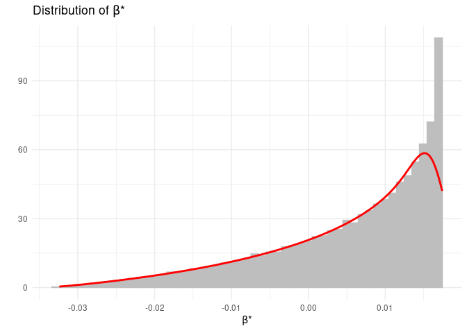

<!-- README.md is generated from README.Rmd. Please edit that file -->

# Bias-Adjusted Treatment Effect (bate)

<!-- badges: start -->
<!-- badges: end -->

## Four Regressions

The goal of the `bate` package is to present some functions to compute
quantiles of the empirical distribution of the bias-adjusted treatment
effect (BATE) in a linear econometric model with omitted variables. To
analyze such models, a researcher should consider four regression
models: (a) a short regression model where the outcome variable is
regressed on the treatment variable, with or without additional
controls; (b) an intermediate regression model where additional control
variables are added to the short regression; (c) a *hypothetical* long
regression model, where an index of the omitted variable(s) is added to
the intermediate regressions; and (d) an auxiliary regression where the
treatment variable is regressed on all observed (and included) control
variables.

As an example, suppose a researcher has estimated the following model,
*y* = *α* + *β*<sub>1</sub>*x* + *γ*<sub>1</sub>*w*<sub>1</sub> + *γ*<sub>2</sub>*w*<sub>2</sub> + *ε*
, and is interested in understanding the impact of some omitted
variables on the results. In this case:

-   outcome variable: *y*
-   treatment variable: *x*
-   short regression: *y* regressed on *x*;
-   intermediate regression: *y* regressed on
    *x*, *w*<sub>1</sub>, *w*<sub>2</sub>;
-   auxiliary regression: *x* regressed on
    *w*<sub>1</sub>, *w*<sub>2</sub>;
-   hypothetical long regression: *y* regressed on
    *x*, *w*<sub>1</sub>, *w*<sub>2</sub> and the omitted variables;

The treatment effect is *β*<sub>1</sub>, but in the presence of omitted
variables, this will be estimated with a bias. The functions in this
package will allow a researcher to create quantiles of the empirical
distribution of the BATE, i.e. the treatment effect once we have
adjusted for the effect of omitted variable bias.

The researcher will need to supply the data set (as a data frame), the
name of the outcome variable, the name of the treatment variable, and
the names of the additional regressors in the intermediate regression.
The functions in this package will then compute the quantiles of the
empirical distribution of BATE.

## Two Important Parameters

Two parameters capture the effect of the omitted variables in this set
up.

The first parameter is *δ*. This captures the relative strength of the
unobservables, compared to the observable controls, in explaining
variation in the *treatement variable*. In the functions below this is
denoted as the parameter `delta`. This parameter is a real number and
can take any value on the real line, i.e. it is unbounded. Hence, in any
specific analysis, the researcher will have to choose a lower and an
upper bound for `delta`. For instance, if in any empirical analysis, the
researcher believes, based on knowledge of the specific problem being
investigated, that the unobservables are *less* important than the
observed controls in explaining the variation in the *treatment
variable*, then she could choose `delta` to lie between 0 and 1. On the
other hand, if she believes that the unobservables are *more* important
than the observed controls in explaining the variation in the *treatment
variable*, then she should choose `delta` to lie between 1 and 2 or 1
and 5.

The second parameter is *R*<sub>*m**a**x*</sub>. This captures the
relative strength of the unobservables, compared to the observable
controls, in explaining variation in the *outcome variable*. In the
functions below, this is captured by the parameter `Rmax`. The parameter
`Rmax` is the R-squared in the hypothetical long regression. Hence, it
lies between the R-squared in the intermediate regression (*R̃*) and 1.
Since the lower bound of `Rmax` is given by *R̃*, in any specific
analysis, the researcher will only have to choose an upper bound for
`Rmax`.

In a specific empirical analysis, a researcher will use domain knowledge
about the specific issue under investigation to determine a plausible
range for `delta` (e.g. 0.01 ≤ *δ* ≤ 0.99). This will be given by the
interval on the real line lying between `deltalow` and `deltahigh` (the
researcher will choose `deltalow` and `deltahigh`). Using the example in
this paragraph, `deltalow=0.01` and `deltahigh=0.99`.

In a similar manner, a researcher will use domain knowledge about the
specific issue under investigation to determine `Rmax`. Here, it will be
important to keep in mind that `Rmax` is the R-squared in the
hypothetical long regression. Now, it is unlikely that including all
omitted variables and thereby estimating the hypothetical long
regression will give an R-squared of 1. This is because, even after all
the regressors have been included, some variation of the outcome might
be plausibly explained by a stochastic element. Hence, `Rmax` will most
likely be different from, and less than, 1. This will be denoted by
`Rhigh` (e.g. `Rmax=0.61`).

## The Algorithm

How is the omitted variable bias and the BATE computed? The key result
that is used to compute the BATE is this: the omitted variable bias is
the real root of a *cubic equation* whose coefficients are functions of
the parameters of the short, intermediate and auxiliary regressions and
the values of `delta` and `Rmax`. In a specific empirical analysis, the
parameters of the short, intermediate and auxiliary regressions are
known. Hence, the coefficients of the cubic equation become functions of
`delta` and `Rmax`, the two key parameters that the researcher chooses,
using domain knowledge.

Once the researchers has chosen `deltalow`, `deltahigh` and `Rhigh`,
this defines a bounded box on the (`delta`, `Rmax`) plane defined by the
Cartesian product of the interval \[`deltalow`, `deltahigh`\] and of the
interval \[`Rlow`, `Rhigh`\]. The main functions in this package
computes the root of the cubic equation on a sufficiently granular grid
(the degree of granularity will be chosen by the user) covering the
bounded box.

To compute the root of the cubic equation, the algorithm first evaluates
the discriminant of the cubic equation on each point of the grid and
partitions the box into two regions: (a) unique real root (URR) and NURR
(no unique real root). There are three cases to consider.

-   **Case 1:** If all points of the bounded box are in URR, then the
    algorithm chooses the unique real root of the cubic at each point as
    the estimate of the omitted variable bias.
-   **Case 2:** If some non-empty part of the box is in NURR, then the
    algorithm first computes roots on the URR region, and then, starting
    from the boundary points of URR/NURR, covers points on the NURR in
    small steps. At each step, the algorithm chooses the real root at a
    grid point in the NURR that is closest in absolute value to the real
    root at a previously selected grid point. Continuity of the roots of
    a polynomial with respect to its coefficients guarantees that the
    algorithm selects the correct real root at each point.
-   **Case 3:** If the bounded box is completely contained in NURR, then
    the algorithm extends the size of the box in small steps in the
    `delta` direction to generate a nonempty intersection with a URR
    region. Once that is found, the algorithm implements the steps
    outlined in step 2.

The bias is then used to compute the BATE, which is defined as the
estimated treatment effect in the intermediate regression *minus* the
bias. This will generate an empirical distribution of the BATE.
Asymptotic theory shows that the BATE converges in probability to the
true treatment effect. Hence, the interval defined by the 2.5-th and
97.5-th quantiles of the empirical distribution of the BATE will contain
the true treatment effect with 95 percent probability.

## The functions

An useful function to collect relevant parameters from the short,
intermediate and auxiliary regressions is:

-   `collect_par()`: collects parameters from the short, intermediate
    and auxiliary regressions; (user provides name of the data set, name
    of outcome variable, name of treatment variable, names of control
    variables in the short regression, if relevant, and names of
    additional variables in the intermediate regression); the output of
    this function is a data frame.

Users can use the output from `collect_par()` to construct an area plot
of the bounded box using:

-   `urrplot()`: creates a colored area plot of the bounded box chosen
    by the user demarcating the area where the cubic equation has unique
    real root (URR) from the area where the cubic equation has three
    real roots (NURR); the output is a plot object.

The main functions in this package that are available for users to
compute empirical distributions of omitted variable bias and BATE are:

-   `ovbias()`: computes the empirical distribution of omitted variable
    bias and BATE (takes the output from `collect_par()` as one of the
    inputs); the output of this function is a list;
-   `ovbias_par()`: computes the empirical distribution of omitted
    variable bias and BATE (takes the data frame, name of outcome
    variable, name of treatment variable, names of control variables in
    the short regression, if relevant, and names of additional variables
    in the intermediate regression, as inputs); the output of this
    function is a list;
-   `ovbias_lm()`: computes the empirical distribution of omitted
    variable bias and BATE (takes three `lm` objects corresponding to
    the short, intermediate and auxiliary regressions as inputs); the
    output of this function is a list.

Using the output from `ovbias()`, `ovbias_par()` or `ovbias_lm()`, users
can construct various plots:

-   `cplotbias()`: contour plot of the bias over the bounded box; the
    output of this function is a plot object;
-   `dplotbate()`: histogram and density plot of BATE; the output of
    this function is a plot object;

The methodology proposed in Oster (2019) is implemented via these
functions:

-   `osterbds()`: identified sets according to Oster’s methodology; the
    output of this function is a data frame;
-   `osterdelstar()`: the value of *δ*<sup>\*</sup> for a chosen value
    of *R*<sub>*m**a**x*</sub>; the output of this function is a data
    frame;
-   `delfplot()`: a plot of the graph of the function,
    *δ* = *f*(*R*<sub>*m**a**x*</sub>); the output of this function is a
    plot object.

## Installation

You can install the development version of bate from
[GitHub](https://github.com/) with:

``` r
# install.packages("devtools")
devtools::install_github("dbasu-umass/bate")
```

## Example: Impact of Maternal Behavior on Child IQ

### Setting Up

Let us load the data set.

``` r
data("NLSY_IQ")
```

The data set has two `.RData` objects: `NLSY_IQ` (to be used for the
analysis of maternal behavior on child IQ) and `NLSY_BW` (to be used for
the analysis of maternal behavior on child birthweight).

Let us see the names of the variables in the `NLSY_IQ` data set.

``` r
names(NLSY_IQ)
#>  [1] "iq_std"             "BF_months"          "mom_drink_preg_all"
#>  [4] "lbw_preterm"        "age"                "female"            
#>  [7] "black"              "motherAge"          "motherEDU"         
#> [10] "mom_married"        "income"             "sex"               
#> [13] "race"
```

Let us set `age` and `race` as factor variables

``` r
NLSY_IQ$age <- factor(NLSY_IQ$age)
NLSY_IQ$race <- factor(NLSY_IQ$race)
```

### Using ovbias()

Let us work with the following example:

-   short regression: `iq_std ~ BF_months + sex + age`
-   intermediate regression:
    `iq_std ~ BF_months + sex + age + income + motherAge + motherEDU + mom_married + race`.

Let us use the `collect_par()` function to collect parameters from the
short, intermediate and auxiliary regressions. Note how
`other_parameters` is a subset of `control`. The researcher needs to
make sure that `control` includes the names of *all* regressors in the
intermediate regression, other than the treatment variable.

``` r
parameters <- bate::collect_par(data=NLSY_IQ,
            outcome="iq_std",
            treatment="BF_months",
            control=c("age","sex","income","motherAge","motherEDU","mom_married","race"),
            other_regressors = c("sex","age"))
```

Let us see the parameters.

``` r
(parameters)
#>                beta0         R0  betatilde   Rtilde    sigmay   sigmax     taux
#> BF_months 0.04447926 0.04465201 0.01740748 0.255621 0.9900242 4.629618 18.99883
```

Let us choose the dimensions of the bounded box over which we want the
bias computation to be carried out.

``` r
# Upper bound of Rmax
Rhigh <- 0.61
# Lower bound of delta
deltalow <- 0.01
# Upper bound of delta
deltahigh <- 0.99
# step size to construct grid
e <- 0.01
```

Now we can use the `ovbias()` function to compute the empirical
distribution of omitted variable bias and BATE. Note that this step make
take a few minutes, depending on the dimensions of the box and the size
of `e`, to complete itself.

``` r
OVB <- bate::ovbias(
  parameters = parameters,
  deltalow=deltalow, 
  deltahigh=deltahigh,
  Rhigh=Rhigh, 
  e=e)
```

We can now see the quantiles of omitted variable bias

``` r
(OVB$bias_Distribution)
#>  2.5%    5%   50%   95% 97.5% 
#> 0.000 0.000 0.009 0.034 0.039
```

and quantiles of the BATE (computed over the bounded box we chose
above).

``` r
(OVB$bstar_Distribution)
#>   2.5%     5%    50%    95%  97.5% 
#> -0.021 -0.017  0.009  0.017  0.017
```

We can create the histogram and density plot of the omitted variable
bias.

``` r
bate::dplotbate(OVB$Data)
```



We can also create a contour plot of BATE over the bounded box.

``` r
bate::cplotbias(OVB$Data)
```


